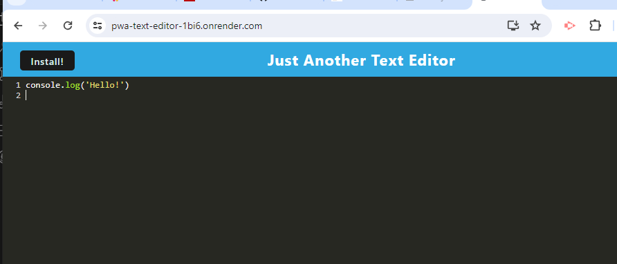

# PWA-Text-Editor
  by Sarah Leder

## Table of Contents
* [Description](#description)
* [Credits](#additional-credits)
* [Usage](#usage-information)
* [Questions](#contact)

### Description
This application is to be used with or without an internet connection as a text editor application. This progressive web application can also be installed like other applications typically available in the application store.
 
### Additional Credits
Most of the resources used were included in the classwork mini project. I also received assistance from the BCS assistant and reviewed a youtube video for a better understand of PWA.
YouTube resource: https://www.youtube.com/watch?v=sFsRylCQblw

### Usage Information
This application can either be installed, run via the terminal using npm start, or using the website: https://pwa-text-editor-1bi6.onrender.com/

### Contact
For questions, please contact me on my website: Github: (https://github.com/Trinity16201/)

Screenshot:

